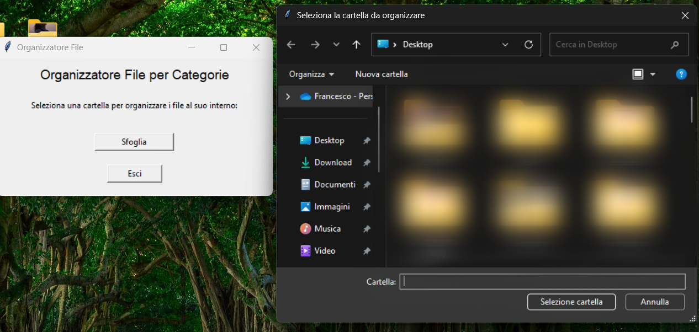
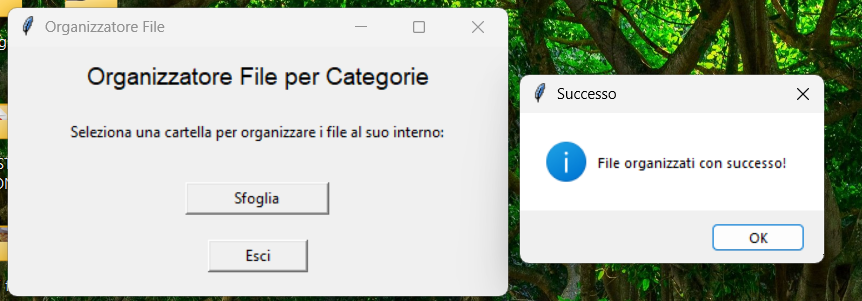

# File Organizer Script

A Python GUI tool to automatically sort files by type into categorized folders.

## 📌 Features

- **GUI-based** (Tkinter) for easy folder selection.

- **Automatically sorts files** into predefined categories:
  - 📁 **Videos** (`.mp4`, `.avi`, `.mov`, `.mkv`, etc.)
  - 📁 **Images** (`.jpg`, `.jpeg`, `.png`, `.heic`, `.gif`, etc.)
  - 📁 **Documents** (`.pdf`, `.docx`, `.xlsx`, `.pptx`, `.txt`, etc.)
  - 📁 **Executables** (`.exe`, `.msi`, `.bat`, `.sh`, etc.)
  - 📁 **Audio** (`.mp3`, `.wav`, `.flac`, etc.)
  - 📁 **Archives** (`.zip`, `.rar`, `.7z`, `.tar`, etc.)
  - 📁 **Others** (uncategorized files remain in the original folder).

- **Creates destination folders** if they don't exist.

- **Lightweight & cross-platform** (works on Windows, macOS, Linux).

## 🛠️ How It Works

1. **Select a folder** via the GUI.
2. The script scans for files and **moves them into subfolders** based on their extensions.
3. **Logs actions** (optional) for tracking changes.

## 🖥️ Screenshot
Select folder to order and execute:
 
 

## 🚀 Use Cases

- Quickly declutter your **Downloads** or **Desktop**.
- Automate file organization on a **Raspberry Pi** or server.
- Keep project directories clean.

## 🔧 Dependencies

- Python 3.x
- `tkinter` (included in standard library)
- `shutil` (for file operations)
